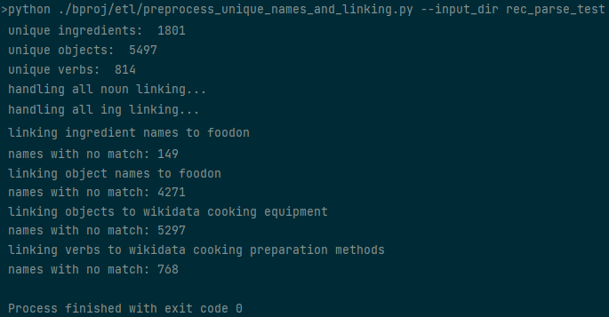
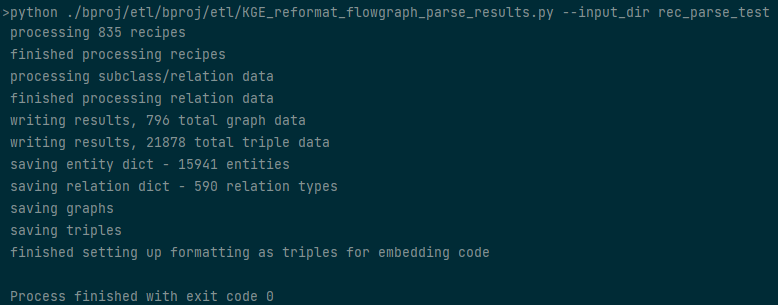
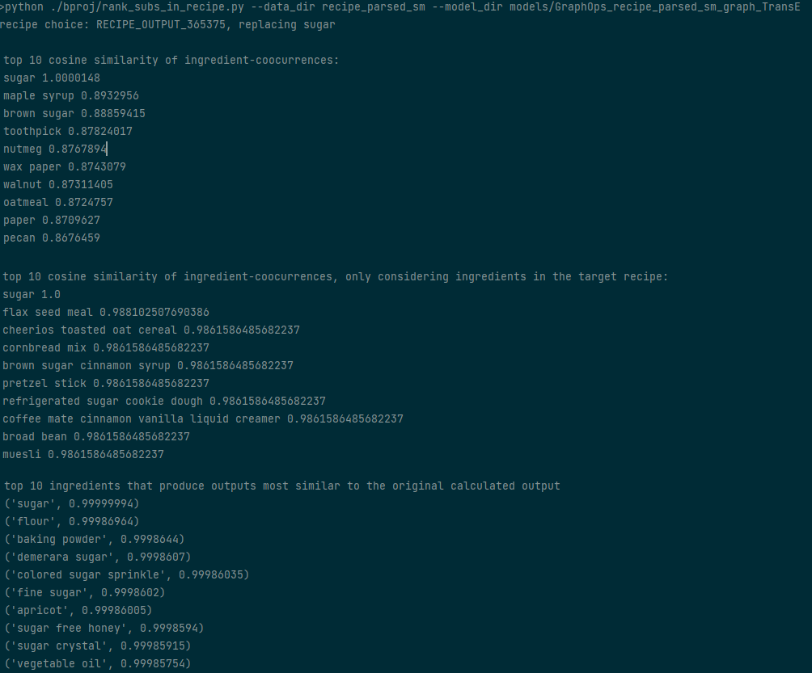
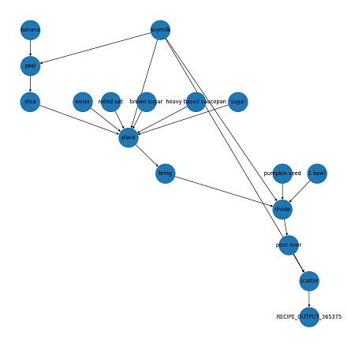

# EaT-PIM 

This repository contains code for proof-of-concept work of the EaT-PIM (**E**mbedding and **T**ransforming  **P**rocedural **I**nstructions for **M**odification) project. This project's general goal is to extract information from procedural instructions, represent it explicitly in a flow graph, and suggest modifications or substitutions of entities that are involved in the instructions. This work focuses on the domain of cooking and identifying reasonable ingredient substitutions within specific recipes. The approach utilized in this code involves processing the natural language instructions from recipes into a flow graph representation, followed by training an embedding model that aims to capture the flow and transformation of ingredients through the recipe's steps. Please note that this software is a research prototype, solely developed for and published as a part of the publication cited above. It will neither be maintained nor monitored in any way.

## Current Features

- Process recipe text to identify nouns and actions taking place in each step
- Link nouns identified in recipe steps to entities from external knowledge sources ([FoodOn](https://foodon.org/) and [Wikidata](https://www.wikidata.org)) 
- Transform processed recipes into a flow graph representation
- Train embedding models using the recipe flow graph data together with external knowledge
- Produce ranking for plausible substitutions based on ingredient embeddings and recipe flow graphs

 
# Quickstart

1. Set up and activate Python 3.8 virtual environment. The following commands 
   
   `python3 -m venv venv/`
   
   `source venv/bin/activate`
2. Install the requirements using `pip install -r requirements.txt`
    - If an error occurs related to `bdist_wheel`, you may also need to `pip install wheel` first. 
3. Download the recipe text data, [RAW_recipes.csv](https://www.kaggle.com/shuyangli94/food-com-recipes-and-user-interactions?select=RAW_recipes.csv). Once you have it downloaded, move this file to `data/RAW_recipes.csv`.
4. Download the appropriate language model for spacy
   
    `python -m spacy download en_core_web_trf`
   
   This is a transformer model, so performance will be much better if you're set up to use a GPU.
5. Install [pygraphviz](https://pygraphviz.github.io/documentation/stable/install.html) for visualization. The following commands are used for installation in Ubuntu.
   
    `sudo apt-get install graphviz graphviz-dev`
   
    `pip install pygraphviz`

    `pip install pydot`
   
    Installation for Windows is slightly more involved - please refer to the installation guide for more 
   details on other systems. 
6. If not using an IDE, you may need to add the project modules to your PYTHONPATH. We used PyCharm for development, using default configurations to automatically handle such situations.
    - E.g., add to PYTHONPATH using the command `export PYTHONPATH=$PYTHONPATH:./eatpim`.
    - If running the workflow via commandline rather than through an IDE, you should now be able to call the scripts appropriately like `python ./eatpim/etl/parse_documents.py ...`.

   
### Optional Step
- Install CUDA (highly recommended if you have an appropriate GPU)
    - Install [CUDA](https://developer.nvidia.com/cuda-toolkit) and [torch](https://pytorch.org/get-started/locally/) choosing an appropriate installation for your CUDA version, and install GPU support for spaCy corresponding with your version of CUDA (e.g., `pip install -U spacy[cuda111]` for CUDA 11.1). More details for spaCy's GPU installation can be found [here](https://spacy.io/usage#gpu).
   - If you try to install spaCy's GPU support before manually installing torch, you might see an error like `module 'torch._C' has no attribute '_cuda_setDevice'`. This error is apparently caused by spaCy incorrectly installing a CPU-version of torch, and the versions cause some kind of conflict. This error is apparently fairly common when installing using pip.

# Workflow 
The workflow to parse raw recipe data into flow graphs and then train embeddings are as follows:

## Parsing Recipe Text and Training Embeddings

1. Run `eatpim/etl/parse_documents.py --output_dir DIRNAME --n_recipes 1000`, specifying the output directory name and the number of recipes to parse. If no recipe count n is specified, all recipes will be parsed -- approx 230,000. Progress will be printed periodically along with the amount of time elapsed.

   

    In the above image, we can see the progress being printed while the script parses all the ingredients in the recipes (converting to singular form), then parsing each of the recipe's contents. The output will create a pickle file containing the parse results, stored to `data/DIRNAME/parsed_recipes.pkl`.

2. Run `eatpim/etl/preprocess_unique_names_and_linking.py --input_dir DIRNAME` to perform some preprocessing over the parse results -- namely making connections between names and entities from FoodOn/Wikidata. Some information about the current progress and intermediate results will be printed periodically (progress info is omitted from the example image).

   
   
    The above example output shows the number of ingredients, objects, and verbs that were detected in the recipes after the parsing from step 1. The script then makes links among objects, ingredients, FoodOn classes, and Wikidata classes. This step will produce two new files, `data/DIRNAME/ingredient_list.json` and `data/DIRNAME/word_cleanup_linking.json`.

3. Run `eatpim/etl/transform_parse_results.py --input_dir DIRNAME --n_cpu n` to convert the parsed recipe data into flowgraphs. Multiprocessing will be used over `n` processes.

   

    Besides showing the current progress and elapsed time, once all recipes have been processed the number of flow graphs generated by each process (assuming multiprocessing was used) is printed, followed by the total number of graphs produced. This step will produce two new files, `data/DIRNAME/entity_relations.json` and `data/DIRNAME/recipe_tree_data.json`

4. Optionally `eatpim/etl/eatpim_reformat_flowgraph_parse_results.py --input_dir DIRNAME` to perform some additional transformations on the flow graph data, to convert it into a format that is suitable for running the embedding code. This code will make a new folder, as `data/DIRNAME/triple_data`, containing several files relevant to training the embedding model.

   
   
    The script in this step will also handle splitting up the data into train/validation/test splits.

5. Run `eatpim/embeddings/codes/run.py` to train embedding code, to learn embeddings for entities and relations that occurred in the recipe flow graph data. The parameters I used to run the training are as follows:
   
   `--do_train
--cuda
--data_path
recipe_parsed_sm
--model
TransE
-n
256
-b
2048
--train_triples_every_n
100
-d
200
-g
24.0
-a
1.0
-lr
0.001
--max_steps
2000000
-save
models/sm_transe_retry
--test_batch_size
4
-adv
-cpu
1
--warm_up_steps
150000
--save_checkpoint_steps
50000
--log_steps
5000
   `
   
    A small snippet of the outputs made while training is shown below - training details like the current loss, training step, and time are logged. Logs are saved to `data/DIRNAME/MODELDIR/train.log`.

   

    - Models will be saved to the specified `-save` directory within `eatpim/embeddings/codes`. 
    - Evaluation can be performed on validation/test data by replacing the `--do_train` argument with `--do_valid` or `--do_test`, respectively.

## Using Embeddings to Rank Substitutions
To use the trained embeddings, run `eatpim/rank_subs_in_recipe.py --data_path DIRNAME --model_dir MODELDIR`. For an example run using trained embedding data uploaded in this repository, you can use `eatpim/rank_subs_in_recipe.py --data_dir recipe_parsed_sm --model_dir models/GraphOps_recipe_parsed_sm_graph_TransE` to see an example of various ranking strategies for a random recipe and random ingredient. Some examples of the outputs can be seen below.

Several different ranking schemes, and the corresponding top-10 "best" substitution options, are shown in the output.

Visualizations of the flow graph also are produced by this step. The above image shows an example visualization of a flow graph of the recipe for which the script is ranking substitutions.

## Data Sources

- data/RAW_recipes.csv was downloaded from [https://www.kaggle.com/shuyangli94/food-com-recipes-and-user-interactions](https://www.kaggle.com/shuyangli94/food-com-recipes-and-user-interactions), containing crawled data from Food.com. This dataset was published in  Bodhisattwa Prasad Majumder, Shuyang Li, Jianmo Ni, Julian McAuley, *Generating Personalized Recipes from Historical User Preferences*, EMNLP, 2019
- data/foodon_ontologies includes several OWL files of rdf data related used to form [FoodOn](https://foodon.org/).
- data/wikidata_cooking contains two nquad files, based on data from [Wikidata](https://www.wikidata.org). The data contains types of culinary equipment and types of food preparations, as well as their labels, subclass relations, and partOf/instanceOf relations.

# License
EaT-PIM is open-sourced under the AGPL-3.0 license. See the [LICENSE](LICENSE) file for details. For a list of other open source components included in EaT-PIM, see the file [3rd-party-licenses.txt](3rd-party-licenses.txt).